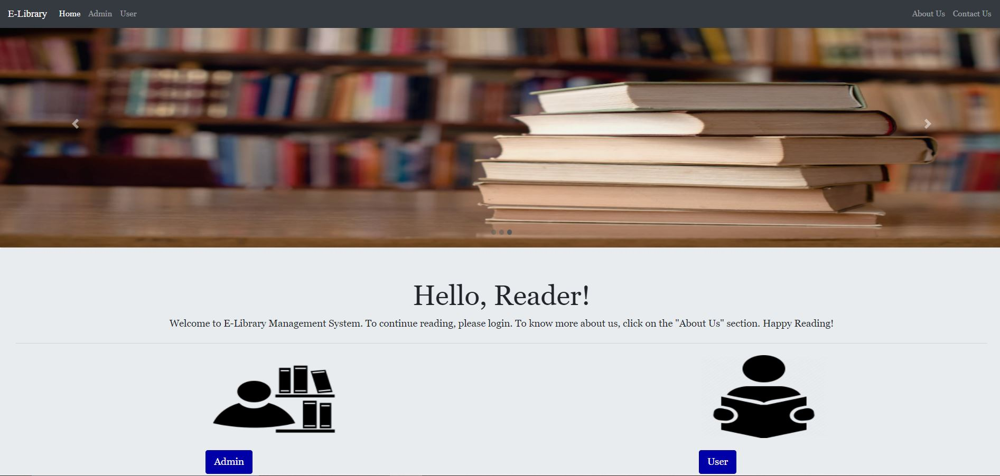
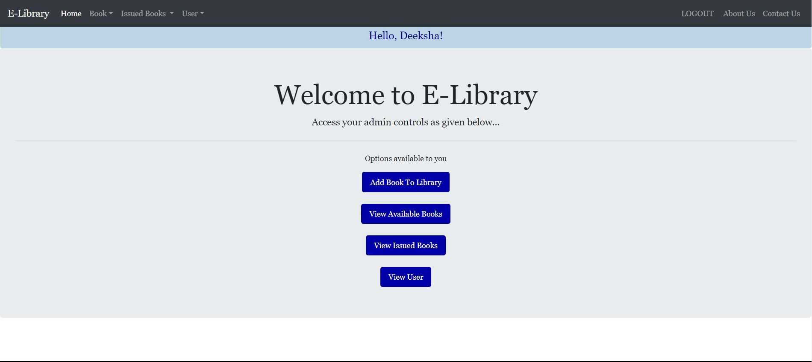
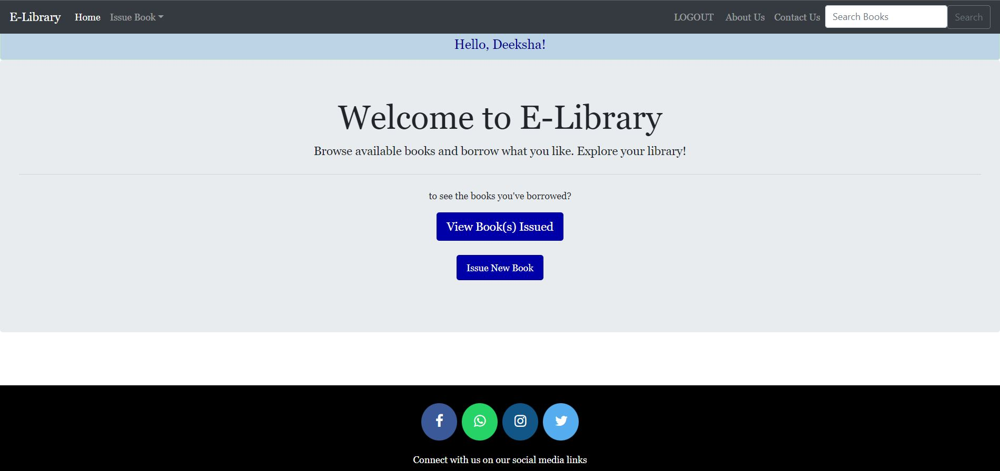

# E-Library-Management-system
# HOW TO RUN THIS PROJECT

 * Install Python(3.7.6) (Dont Forget to Tick Add to Path while installing Python)
  
 * Open Terminal and Execute Following Commands :
  
       python -m pip install -r requirements.txt

* Download This Project Zip Folder and Extract it

* Move to project folder in Terminal. Then run following Commands :

      py manage.py makemigrations

      py manage.py migrate

      py manage.py runserver
 
* Now enter following URL in Your Browser Installed On Your Pc

	  http://127.0.0.1:8000/
	  
	  
## Functions
### Admin
- Create Admin account and Login.
- Can Add and View books in the database.
- Can view Fine
- Can View users that are registered into the system.

### User
- Create account and Login.
- Can view books issued by them with its details
- Can issue a new book.
- Can search for books.
---	

## POINTS TO BE NOTED:
- Click on "E-Library" in the navigation bar to go to home page.
- Contact Us page is currently not fully responsive.
<h3>Home Page</h3>
 

 
  

 <h3>Adim Home Page</h3>
 

 
 

 <h3>User Home Page</h3>
 

 
 

<h3> 🖲️Tech Stack🖱</h3>
 
 * Frontend (HTML,CSS,JS)
 * Backend(Django,Python,SQL)

